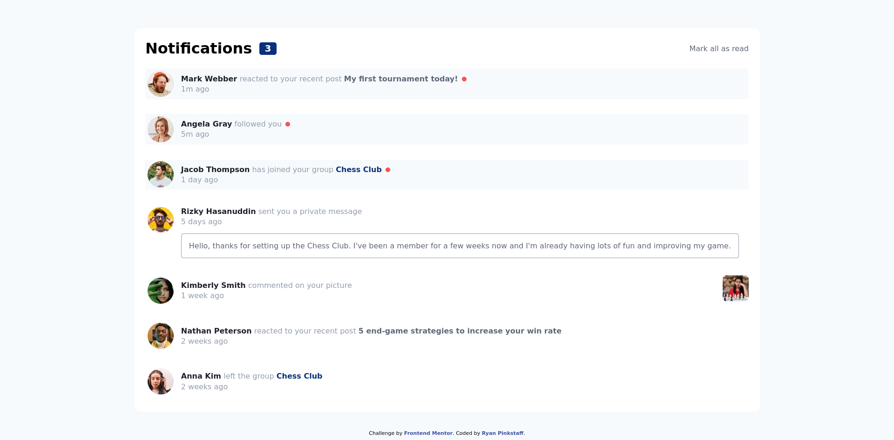

# Frontend Mentor - Notifications page solution

This is a solution to the [Notifications page challenge on Frontend Mentor](https://www.frontendmentor.io/challenges/notifications-page-DqK5QAmKbC). Frontend Mentor challenges help you improve your coding skills by building realistic projects. 

## Table of contents

- [Overview](#overview)
  - [The challenge](#the-challenge)
  - [Screenshot](#screenshot)
  - [Links](#links)
- [My process](#my-process)
  - [Built with](#built-with)
  - [What I learned](#what-i-learned)
  - [Continued development](#continued-development)
- [Author](#author)

**Note: Delete this note and update the table of contents based on what sections you keep.**

## Overview
The technology used to build this app were HTML5, CSS, and Javascript.  Using those technologies I built the app as close to the pictures in the design file.

### The challenge

Users should be able to:

- Distinguish between "unread" and "read" notifications
- Select "Mark all as read" to toggle the visual state of the unread notifications and set the number of unread messages to zero
- View the optimal layout for the interface depending on their device's screen size
- See hover and focus states for all interactive elements on the page

### Screenshot



### Links

- Solution URL: [https://rdpinkst.github.io/notifications-page-main/]
- Live Site URL: [https://github.com/rdpinkst/notifications-page-main]

## My process
I started by building the HTML5 markup, and trying to make sure I was using Semantic HTML5.  Then I started styling and adding HTML5 markup, when I needed to make the element look a certain way.  Once the page looked close to the pictures in the design file, I started adding the javascript to make the read items change states when clicked.  Once functioning correctly, I looked at the mobile design for 375px and added a media query to get my app looking close to design.

### Built with

- Semantic HTML5 markup
- Flexbox
- Mobile-first workflow for 375px screen
- Javascript

### What I learned

Completing this challenge I learned that the dots for unread should be inline-block elements, which I mad a span, instead of a div outside of the p tag.

To see how you can add code snippets, see below:

```html
          <p><span>Rizky Hasanuddin</span> sent you a private message  <span class="unread"></span></p>
```
```css
.unread {
  display: inline-block;
}
```

### Continued development

I designed this app just to look and function like the pictures in the design files.  I could continue development of this app and take away the event listener on the articles and just have them on the name and/or post/groups.  I could make the names anchor tags, which they probably should be, linking to the persons profile.  I could also work on media queries between 375 and the desktop size.

## Author

- Frontend Mentor - [@rdpinkst](https://www.frontendmentor.io/profile/rdpinkst)
